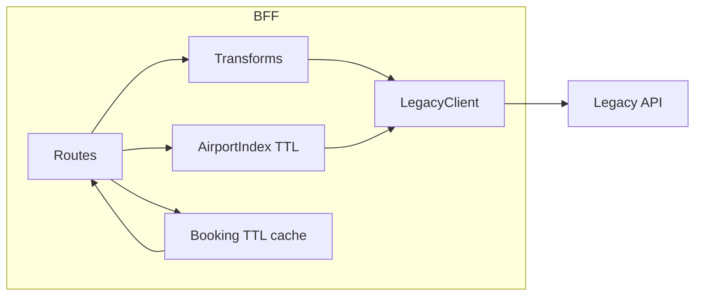

# Flight BFF — Design & delivery notes

## 1. API design (REST + FastAPI)

**Why REST + FastAPI (instead of GraphQL/Django)?**

- The assessment describes a clear CRUD-style flow (search → offer → book → retrieve); REST maps 1:1 to those use cases, works well for web/mobile, and OpenAPI/Swagger is built in.
- FastAPI provides validation (Pydantic), async `httpx`, and OpenAPI docs without a separate GraphQL stack.

**Wrapper URLs (`/v1/...`)**

- `POST /v1/flights/search` — flight search, flat response + `page`, `page_size`, `total`.
- `GET /v1/flights/offers/{offer_id}` — fare rules, baggage, payment, normalized timestamps.
- `POST /v1/bookings` — create booking; BFF validates input before calling legacy.
- `GET /v1/bookings/{reference}` — booking summary + cache (via `X-Cache` header).
- `GET /v1/airports`, `GET /v1/airports/{code}` — airport metadata with city merged when available.

**Unified errors**

Business/legacy errors return:

```json
{
  "error": {
    "code": "STRING",
    "message": "human readable",
    "details": {},
    "request_id": "uuid"
  }
}
```

422 validation uses the same shape with `code: "VALIDATION_ERROR"` and `details.fields` (raw FastAPI validation errors).

## 2. Architecture

```
Client → FastAPI routers → Services (transform + cache) → LegacyClient (httpx) → mock-travel-api
```

- **Routers** (`app/api/routes/`): HTTP contract, query flags (`simulate_issues`).
- **Services** (`app/services/`): transform legacy payloads → UI-friendly models; airport index.
- **LegacyClient** (`app/legacy/client.py`): upstream calls, retry with backoff, simple circuit breaker.
- **Core** (`app/core/`): multi-format datetime parsing, code → label maps, `AppError`.



## 3. Resilience

- **Retry + backoff**: up to `MAX_RETRIES` for network timeouts, HTTP 5xx, and 429 (rate limit).
- **Circuit breaker**: after `CIRCUIT_FAILURE_THRESHOLD` upstream-related failures, return 503 `CIRCUIT_OPEN` for `CIRCUIT_OPEN_SECONDS`.
- **`simulate_issues` query**: forward `?simulate_issues=true` to legacy to exercise latency/503/429 as described in the brief.

## 4. Caching

| Data | Mechanism | TTL | Invalidation |
|------|-----------|-----|--------------|
| Airport list (city-enriched) | `cachetools.TTLCache` in `AirportIndex` | `AIRPORT_CACHE_TTL_SECONDS` (default 1h) | TTL expiry; separate cache key per `simulate_issues` |
| Booking by reference | `TTLCache` on `app.state` | `BOOKING_CACHE_TTL_SECONDS` (default 60s) | TTL expiry; overwritten after `POST /v1/bookings` |

Pricing and availability are **not** cached.

## 5. AI workflow (template for your submission)

- **Tools**: Cursor + LLM (e.g. Claude) — analyze `backend-assessment.docx`, read legacy OpenAPI (`/openapi.json`), scaffold FastAPI and transforms from real JSON samples (`curl` flightsearch/offer/booking).
- **What sped up work**: mapping nested search fields → `OfferSummary`, listing endpoints and folder layout.
- **What needed manual fixes**: wiring `Annotated[..., Depends(...)]` (FastAPI requires `Depends`); ordering circuit breaker vs 4xx handling; smoke tests with `uvicorn` + `curl`.

You should add your own concrete prompts and commit history reflecting how you actually worked.

## 6. Implementation steps (incremental)

1. **Scaffold & config** — `requirements.txt`, `app/config.py`, `app/main.py`, `/health`.
2. **Legacy client** — async `httpx`, retry, circuit breaker, forward `simulate_issues`.
3. **Errors** — `AppError`, handlers, normalize the four legacy error shapes in `normalize_upstream_error_payload`.
4. **Airports** — list + city enrichment (parallel per-code fetches), TTL cache.
5. **Search** — flatten legs, airline/cabin/aircraft labels, normalized pricing, BFF-side pagination.
6. **Offer / booking** — transform + validation; cache GET booking.
7. **Docs** — local README + this file; verify OpenAPI at `/docs`.

## 7. Setup (summary)

See [README.md](README.md).
