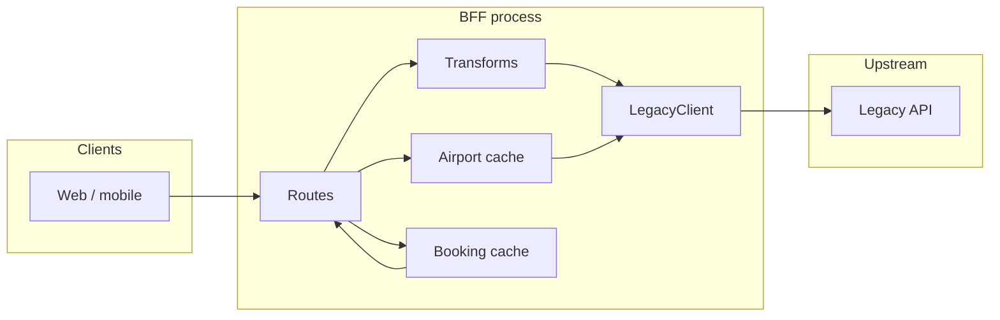

# Flight Booking BFF (FastAPI)

Backend-for-Frontend (BFF) over the legacy mock GDS at [mock-travel-api](https://mock-travel-api.vercel.app/docs). This repo exposes a **consistent `/v1` REST API**, OpenAPI at `/docs`, and hides nested legacy payloads, mixed date formats, and inconsistent error shapes.

---

## AI approach

Document your **actual** process when submitting; below is a **template** that matches how this codebase was built.

| Area | Example |
|------|---------|
| **Tools** | Cursor + Chat/Composer; optional: Copilot, CLI `curl`, legacy `/openapi.json`. |
| **Tasks accelerated** | Parsing the take-home doc; generating folder layout; drafting `LegacyClient` and Pydantic models; initial nested search → flat `OfferSummary` mapping from sample JSON. |
| **Prompts that worked** | “Given this sample `flightsearch` JSON, write a function that returns a list of flat offers with airline name, ISO departure, total price, stops.” / “Normalize these four legacy error JSON shapes into one `(code, message)`.” |
| **Where human intervention was required** | FastAPI **`Annotated[..., Depends(...)]`** must wrap callables with `Depends()`; reordering **circuit breaker** vs **4xx** so client errors do not skew breaker counts; verifying **date** edge cases (epoch, `YYYYMMDDHHMMSS`, `DD-Mon-YYYY`) against real responses; smoke tests with **`uvicorn` + `curl`** and Render **`PORT`**. |

**Replace the table above** with your real prompts, screenshots, or commit timeline before final submission.

### Cursor Rules & Skills (repeatable workflow)

This repo ships **project-scoped** guidance so new endpoints stay consistent (errors, layers, caching, OpenAPI).

| Artifact | Path | Purpose |
|----------|------|---------|
| **Rules** (always-on + file-scoped) | `.cursor/rules/*.mdc` | Enforce boundaries: `LegacyClient` only for HTTP, unified `AppError` shape, `/v1` conventions, when to use TTL cache. |
| **Skill** (workflow) | `.cursor/skills/flight-bff-extend-api/SKILL.md` | Step-by-step checklist for “new legacy call → client method → transform → route → optional cache → verify”. |

**How to demo:** In Cursor, mention *“apply the flight BFF skill”* or *“follow `.cursor` rules”* when asking for a new endpoint; enable **Project Rules** so `flight-bff-core` (always apply) and globs for `app/api`, `app/services`, and `app/legacy` activate while editing those files.

---

## Setup (run locally)

1. **Clone** the repository and `cd` into the project root.
2. **Create a virtual environment** (Python 3.12+ recommended; `runtime.txt` pins **3.12.8** for Render):

   ```bash
   python3 -m venv venv
   source venv/bin/activate    # Windows: venv\Scripts\activate
   ```

3. **Install dependencies**:

   ```bash
   pip install -r requirements.txt
   ```

4. **Start the API**:

   ```bash
   uvicorn app.main:app --reload --host 0.0.0.0 --port 8000
   ```

5. **Verify**:
   - Health: [http://localhost:8000/health](http://localhost:8000/health) → `{"status":"ok"}`
   - Swagger: [http://localhost:8000/docs](http://localhost:8000/docs)

Optional: export variables in your shell or configure them on your host (see **Environment variables** in the Documentation section).

---

## Documentation

This section covers **API design, architecture, resilience, caching, and environment variables** from the take-home brief. **AI approach** (tools, prompts, validation habits, Cursor rules/skills) is **[above](#ai-approach)**.

### 1. API design decisions

**Why REST instead of GraphQL**

- The flow is naturally **resource-oriented**: search → offer → book → retrieve. REST maps **one endpoint per use case**, which is easy for web and mobile clients and matches common HTTP tooling.
- **OpenAPI/Swagger** is generated by FastAPI without a separate GraphQL schema, server, or client stack.
- GraphQL would add complexity (resolver design, N+1 toward legacy, caching semantics) for little gain when the UI needs fixed, curated payloads rather than arbitrary graphs.

**Why FastAPI (vs Django)**

- **Async `httpx`** fits an I/O-bound BFF that calls a remote legacy API.
- **Pydantic** validates wrapper inputs before forwarding; response models document the **downstream** contract.
- Lightweight routing and automatic `/docs` align with “clean, documented API” in the brief.

**URL and schema philosophy**

- All wrapper routes live under `**/v1`** with **lowercase, plural nouns** where it reads naturally: `flights`, `bookings`, `airports`, `reference`.
- **`GET /v1/reference/labels`** exposes static **code → label** maps (airlines, cabins, aircraft, tax codes, passenger types) from `app/core/labels.py`. It **does not call legacy**; responses use long **`Cache-Control`** so browsers/CDNs can cache and search payloads can stay smaller.
- **Query parameters** carry cross-cutting concerns: `page`, `page_size`, `simulate_issues` (forwarded to legacy as `?simulate_issues=true` when true).
- **Request bodies** use **flat, explicit fields** (e.g. `origin`, `destination`, `departure_date`) instead of mirroring legacy nesting.
- **Responses** are **flattened and labeled** for UI work: e.g. `OfferSummary` with `legs[]`, `airline_name`, ISO-like times, single money shape — not the legacy tree under `data.flight_results...`.

**Error response structure**

All consumer-facing errors use **one JSON shape** (including validation):

```json
{
  "error": {
    "code": "STRING",
    "message": "Human-readable summary",
    "details": {},
    "request_id": "uuid"
  }
}
```

- `**LEGACY_ERROR**`: upstream returned 4xx; `details` may include `legacy_code` and `status_code`.
- `**VALIDATION_ERROR**` (HTTP 422): `details.fields` holds FastAPI/Pydantic validation detail.
- Other examples: `UPSTREAM_TIMEOUT` (504), `UPSTREAM_RATE_LIMIT` (429), `CIRCUIT_OPEN` (503).

Legacy exposes **four different error JSON shapes**; the wrapper normalizes them in `app/core/errors.py` (`normalize_upstream_error_payload`) before surfacing a consistent message to clients.

**Upstream → downstream data transformation**

- **Separation of concerns**: `app/legacy/client.py` fetches **raw** JSON; `app/services/transform_*.py` maps to **Pydantic models** in `app/schemas/api.py` (the public contract).
- **Search**: collect `leg_data` across `segment_list`, derive first/last airport and times, unify price from `total` / `total_amount` / `totalAmountDecimal`, attach **labels** (airline, cabin, aircraft, tax codes) via `app/core/labels.py`.
- **Dates**: arbitrary legacy strings, epochs, and `YYYYMMDDHHMMSS` are normalized through `app/core/dates.py` (`parse_to_iso`) where enrichment is needed.
- **Airports**: list endpoint from legacy lacks city; the BFF **enriches** by calling per-code upstream detail and merges into one list for the client.

---

### 2. Architecture overview

**Layer boundaries**

```text
Browser / mobile / Postman
        →  FastAPI routers (HTTP + OpenAPI)
        →  Services (transform, airport index orchestration)
        →  LegacyClient (httpx, retries, circuit breaker)
        →  Legacy flight API (mock-travel-api)
```

**Where caching sits**

- **In-process memory** on the app instance: not a separate Redis/DB.
- **Airport index**: `AirportIndex` in `app/services/airports.py` uses `cachetools.TTLCache` (keyed also by whether `simulate_issues` is used).
- **Booking GET**: `TTLCache` on `app.state` in `app/main.py` lifespan; populated on `POST /v1/bookings` and on cache-miss `GET /v1/bookings/{ref}`.




**Codebase structure**


| Path                 | Role                                                                                 |
| -------------------- | ------------------------------------------------------------------------------------ |
| `app/main.py`        | FastAPI app, lifespan, middleware (`X-Request-Id`), exception handlers, router mount |
| `app/config.py`      | `pydantic-settings` — timeouts, retries, TTLs, `LEGACY_BASE_URL`                     |
| `app/api/routes/`    | HTTP endpoints: `flights`, `offers`, `bookings`, `airports`, `reference`, `health`   |
| `app/api/deps.py`    | `Depends` wiring for settings, client, airport index                                 |
| `app/schemas/api.py` | Public request/response models                                                       |
| `app/services/`      | Transforms + `airports.py` enrichment/cache + `reference_labels.py` (static maps)     |
| `app/legacy/`        | `client.py` (httpx), `circuit.py` (breaker)                                          |
| `app/core/`          | `errors.py`, `dates.py`, `labels.py`                                                 |


---

### 3. Resilience patterns


| Situation                | Wrapper behavior                                                                                                                                                                    |
| ------------------------ | ----------------------------------------------------------------------------------------------------------------------------------------------------------------------------------- |
| **Network timeout**      | Retries with exponential backoff up to `MAX_RETRIES`; then `**UPSTREAM_TIMEOUT`** (504). Failures count toward the circuit breaker.                                                 |
| **HTTP 5xx from legacy** | Treated as transient: **retry** with backoff; if exhausted, `**UPSTREAM_ERROR`** (502) and breaker records failure.                                                                 |
| **HTTP 429**             | Treated as transient: **retry** with backoff; if exhausted, `**UPSTREAM_RATE_LIMIT`** (429). Breaker records failure.                                                               |
| **HTTP 4xx from legacy** | **No retry**; mapped to `**LEGACY_ERROR`** with upstream message. Does not open the circuit (client/validation issues).                                                             |
| **Circuit open**         | After repeated upstream failures (`CIRCUIT_FAILURE_THRESHOLD`), short **503 `CIRCUIT_OPEN`** window (`CIRCUIT_OPEN_SECONDS`) so the service fails fast instead of hammering legacy. |
| **Simulated chaos**      | Query `simulate_issues=true` on wrapper endpoints is **forwarded** to legacy so you can demo latency, 503, and 429 against stable local dev (`false`).                              |


Implementation: `app/legacy/client.py` (retry loop), `app/legacy/circuit.py` (breaker), `app/core/errors.py` (unified client errors).

---

### 4. Caching strategy


| What                                              | Where                                   | TTL (default)                       | Invalidation                                                                                                          |
| ------------------------------------------------- | --------------------------------------- | ----------------------------------- | --------------------------------------------------------------------------------------------------------------------- |
| **Enriched airport list** (codes + city + coords) | `TTLCache` inside `AirportIndex`        | `AIRPORT_CACHE_TTL_SECONDS` (3600s) | Time-based expiry; separate cache entry when `simulate_issues` differs so test mode does not poison normal cache.     |
| **Booking snapshot** by reference                 | `TTLCache` on `app.state.booking_cache` | `BOOKING_CACHE_TTL_SECONDS` (60s)   | Time-based expiry; **overwrite** when the same reference is returned again from `POST /v1/bookings` or a fresh `GET`. |
| **Search results, offers, prices**                | Not cached                              | —                                   | Always live from legacy when requested.                                                                               |
| **Reference label maps** (`GET /v1/reference/labels`) | HTTP `Cache-Control` on the response | `max-age=86400` (+ `stale-while-revalidate`) | Client/CDN revalidate; update `app/core/labels.py` and redeploy to change data.                                        |


`GET /v1/bookings/{ref}` returns header `**X-Cache: HIT`** or `**MISS**` for transparency.

---

### 5. Environment variables


| Variable                    | Default                              | Description                     |
| --------------------------- | ------------------------------------ | ------------------------------- |
| `LEGACY_BASE_URL`           | `https://mock-travel-api.vercel.app` | Upstream base URL               |
| `HTTP_TIMEOUT_SECONDS`      | `30`                                 | Per-request timeout to legacy   |
| `MAX_RETRIES`               | `3`                                  | Retries (timeout, 5xx, 429)     |
| `CIRCUIT_FAILURE_THRESHOLD` | `5`                                  | Failures before opening circuit |
| `CIRCUIT_OPEN_SECONDS`      | `30`                                 | Duration circuit stays open     |
| `AIRPORT_CACHE_TTL_SECONDS` | `3600`                               | Airport list cache TTL          |
| `BOOKING_CACHE_TTL_SECONDS` | `60`                                 | Booking GET cache TTL           |


---

## Debug in Cursor / VS Code

1. Activate the venv and `pip install -r requirements.txt`.
2. Install the **Python** extension.
3. **Run and Debug** → **FastAPI: uvicorn (reload + debug)** (see `.vscode/launch.json`).

If breakpoints skip with `--reload`, use **FastAPI: uvicorn (no reload — stable breakpoints)**.

---

## Deploy on [Render](https://render.com)

Render injects **`PORT`**. Start command:

`uvicorn app.main:app --host 0.0.0.0 --port $PORT`

**Blueprint:** **New** → **Blueprint** → select repo → `render.yaml`.

**Manual Web Service:** **New** → **Web Service** → **Build:** `pip install -r requirements.txt` → **Start:** command above → **Health check path:** `/health` → set `LEGACY_BASE_URL` if needed. Align **Python** with `runtime.txt` / `PYTHON_VERSION`.

Live docs: `https://<service>.onrender.com/docs`

### Render deploy (step-by-step)

#### BFF Swagger URL

After deploy, your wrapper docs are at:

`https://<service-name>.onrender.com/docs`

The exact URL is shown on the service **Dashboard** (copy from **URL**).

**Note:** A fragment like `...#/Airports/list_airports_api_v1_airports_get` belongs to the **legacy** Swagger (Vercel mock). This BFF uses paths under **`/v1/...`** and tags such as **`airports`**. A deep link might look like:

`https://<service>.onrender.com/docs#/airports/list_airports_v1_airports_get`

The part after `#` can vary slightly by FastAPI / Swagger UI version; opening `/docs` and expanding the **airports** group is enough.

#### Create a Web Service (dashboard)

1. Go to [render.com](https://render.com) → **New +** → **Web Service** → connect this repository (choose branch, e.g. `main`).
2. **Build command:** `pip install -r requirements.txt`
3. **Start command:** `uvicorn app.main:app --host 0.0.0.0 --port $PORT`
4. **Health check path:** `/health`
5. **Environment variables** (recommended): `LEGACY_BASE_URL=https://mock-travel-api.vercel.app`; optionally `PYTHON_VERSION=3.12.8` to match `runtime.txt`.
6. Click **Create Web Service** → wait until status is **Live** → open the service URL and verify `GET /health` and `GET /docs`.

**Blueprint:** **New +** → **Blueprint** → select the repository that contains `render.yaml` → **Apply** (adjust service name on Render if you want a specific subdomain).

#### Free tier

Instances **sleep** when idle; the first request after sleep may take **~30–60 seconds** while the service wakes. If the build fails on Python version, align **PYTHON_VERSION** / `runtime.txt` with a [supported Render runtime](https://render.com/docs/native-runtimes#python).

---

## Backend structure (review)

```text
app/
├── main.py                 # FastAPI app, lifespan, middleware, routers, exception handlers
├── config.py               # Settings / env (timeouts, TTLs, LEGACY_BASE_URL)
├── api/
│   ├── deps.py             # Depends(get_legacy_client), settings, airport index
│   └── routes/             # HTTP: flights, offers, bookings, airports, reference, health
├── schemas/api.py          # Public Pydantic contracts (wrapper-facing)
├── services/               # Transforms + AirportIndex + reference_labels (static maps)
├── legacy/
│   ├── client.py           # httpx, retry/backoff, circuit breaker, simulate_issues
│   └── circuit.py
└── core/                   # errors.py, dates.py, labels.py
```

**Data flow:** `routes` → `services` (normalize/enrich) → `LegacyClient` → upstream. **No DB**; in-memory TTL caches only (`AirportIndex`, `booking_cache` on `app.state`).

---

## Further reading

- Extended notes and implementation checklist: [DOCUMENTATION.md](DOCUMENTATION.md)

